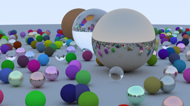

# Raytracing in one Weekend in Typescript

Read the book at: 
https://raytracing.github.io/books/RayTracingInOneWeekend.html

## render the scene

```
$ npm run create -- images/image_final.ppm && open images
```

## Final rendering



### timeings

 * rendering the final image in the pure typescript implementation takes ~7m20s